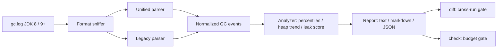

# gcgauge

[English](README.md) | [中文](README.zh.md) | [日本語](README.ja.md)

[](LICENSE) [](CHANGELOG.md) [](pyproject.toml)  [](CONTRIBUTING.md)

**オープンソースの JVM GC ログ解析ツール — ポーズのパーセンタイル、ヒープ傾向、リーク指標を決定的なオフラインレポートとして出力し、実行間 diff にも対応。アップロードなし、ブラウザ不要、ベンダー非依存。**


```bash
git clone https://github.com/JaydenCJ/gcgauge && cd gcgauge && pip install -e .
```

> **プレリリース：** gcgauge はまだ PyPI に公開されていません。初回リリースまでは [JaydenCJ/gcgauge](https://github.com/JaydenCJ/gcgauge) をクローンし、リポジトリのルートで `pip install -e .` を実行してください。

## なぜ gcgauge？

今日の GC ログ解析は、本番ログを Web サービスに貼り付けて機密情報が入っていないことを祈るか、デスクトップ GUI を開いてグラフを目視するか、のどちらかになりがちです。どちらも JVM 性能調査の実際の現場 — SSH 先のサーバー、CI ジョブの中、先週の実行との比較 — には合いません。gcgauge は依存ゼロの Python CLI で、生の GC ログをポーズのパーセンタイル、ヒープ傾向、スコア付きのリーク判定に変換します。しかも同一入力に対してレポートはバイト単位で一致するため、2 つの実行を機械的に diff し、リグレッションでビルドを落とせます。ログがマシンの外に出ることはありません。

|  | gcgauge | GCeasy | GCViewer | garbagecat |
|---|---|---|---|---|
| 完全オフライン | はい | いいえ（Web サービスへアップロード） | はい | はい |
| インターフェース | CLI + JSON | ブラウザ | デスクトップ GUI | CLI |
| JVM のインストールが必要 | いいえ — 任意の Python 3.9+ | いいえ | はい | はい |
| 決定的で diff 可能な出力 | はい（バイト単位一致の JSON） | いいえ | いいえ | いいえ |
| 終了コード付きの実行間リグレッションゲート | はい（`diff`、`check`） | いいえ | いいえ | いいえ |
| ランタイム依存 | 0 | SaaS | Java + GUI ツールキット | Java 11+ |

<sub>2026-07 時点の特徴：GCeasy はアップロード型の Web 解析サービス（無料枠は API クォータあり）。GCViewer 1.36 は Swing デスクトップアプリ。garbagecat 4.x は固定テキストレポートを出力する Java CLI。gcgauge の依存数は [pyproject.toml](pyproject.toml) の `dependencies = []` の通りです。</sub>

## 特徴

- **実際に起きたポーズのパーセンタイル** — 回収クラス（young / mixed / full / ...）ごとに最近接順位法の p50/p90/p95/p99/max を算出。どのリクエストも経験していない補間値は決して出しません。
- **2 つのログ方言、1 つのイベントモデル** — JDK 9+ の統合ログ（`-Xlog:gc`）と JDK 8 の `-XX:+PrintGCDetails` に対応し、G1、Parallel、Serial、CMS、ZGC、Shenandoah の行形式をカバー。正規化後の解析コードは方言の違いを一切意識しません。
- **証拠付きのリーク指標** — 6 つの重み付きヒューリスティクス（r² 付き GC 後フロア上昇、full GC 頻度の増加、full GC 回収率の低下、退避失敗、高占有率の継続、OutOfMemoryError）を `none`/`possible`/`likely` の判定に集約。トリガーの有無にかかわらず証拠を表示します。
- **構造からの決定性** — 時計を読まず、乱数なし、固定丸め、JSON キーはソート済み：同一ログはどのマシンでもバイト単位一致のレポートになり、コミット可能で diff 可能な成果物になります。
- **CI を止められる実行間 diff** — `gcgauge diff baseline current` がパーセンタイル、GC オーバーヘッド、full GC 頻度、リーク判定をしきい値付きで比較し、リグレッションで終了コード 1 を返します。両側とも生ログでも保存済み JSON レポートでも構いません。
- **壊れないパーサー** — 途中で切れた行、混在エンコーディング、順序が乱れた連結、タイムスタンプなしのログも、スタックトレースではなく明示的な警告付きで優雅に処理します。

## クイックスタート

インストールして、同梱のサンプルログに対して実行します：

```bash
git clone https://github.com/JaydenCJ/gcgauge && cd gcgauge && pip install -e .
gcgauge report examples/g1-leak.log
```

出力（実際の実行結果より）：

```text
gcgauge report — examples/g1-leak.log
format: unified   collector: G1   clock: uptime
events: 173 (160 pauses, 13 concurrent)   window: 12.67s -> 1789.43s (29.6 min)

Pause percentiles (ms)
  class  count     p50     p90     p95     p99     max     total
  young    116   13.96   23.32   27.48   28.96   29.31   1762.97
  mixed     13   21.96   29.00   29.01   29.01   29.01    285.56
  full      31  715.66  883.20  887.67  899.37  899.37  21222.11
  all      160   17.86  675.24  828.69  887.67  899.37  23270.63

Throughput 98.69% — 23.27s paused of 1776.76s   Allocation rate 33.62 MB/s

Heap (total 4096.0 MB)
  post-GC floor: 731.00 MB -> 3645.00 MB   slope +110.150 MB/min   r²=0.946 (160 samples, all collections basis)
  post-GC occupancy, last quarter: 89.6% of heap
  full GC: 31 total (0 first half -> 31 second half), avg reclaim 5.4% of heap

Leak indicators — verdict: LIKELY (score 10/14)
  [critical] rising post-GC floor      +110.15 MB/min over 29.6 min, r²=0.95 (all collections basis)
  [warn    ] full GC frequency growth  0 full GC in the first half -> 31 in the second
  [warn    ] low full-GC reclaim       recent full GCs reclaim only 5.5% of heap
  [warn    ] evacuation failure        31 event(s) with to-space exhausted / promotion failed
  [warn    ] post-GC occupancy         89.6% of heap still live in the last quarter of the run
  [ok      ] OutOfMemoryError          not present
```

2 つの実行を比較 — 健全なベースラインとリークした実行（終了コード 1 なので CI にそのまま組み込めます）：

```bash
gcgauge diff examples/g1-steady.log examples/g1-leak.log
```

```text
gcgauge diff — baseline: examples/g1-steady.log   current: examples/g1-leak.log
threshold: 10.0%

metric             baseline  current      delta     verdict
p50 pause (ms)        10.21    17.86     +75.0%  regression
p90 pause (ms)        16.49   675.24   +3994.3%  regression
p99 pause (ms)        18.43   887.67   +4717.2%  regression
max pause (ms)        18.52   899.37   +4756.2%  regression
GC overhead (%)        0.10     1.31   +1210.0%  regression
full GC / min          0.00     1.05        new  regression
alloc rate (MB/s)     36.73    33.62      -8.5%        info
leak verdict           none   likely  escalated  regression

7 regression(s) beyond the 10.0% threshold
```

あるいは単一の実行を明示的なバジェットで検査し、数 MB のログの代わりに JSON ベースラインを保存しておくこともできます：

```bash
gcgauge check examples/g1-steady.log --max-p99 50 --min-throughput 99 --fail-on-leak possible
gcgauge report examples/g1-steady.log --format json -o baseline.json   # 来週これと diff する
```

## 対応ログ形式

| 形式 | JVM フラグ | 対応コレクタ |
|---|---|---|
| 統合ログ（JDK 9+） | `-Xlog:gc`（`uptime`/`time`/装飾なしのいずれも可） | G1、Parallel、Serial、ZGC（世代別含む）、Shenandoah |
| レガシー（JDK 8） | `-XX:+PrintGCDetails` に `-XX:+PrintGCTimeStamps` や `-XX:+PrintGCDateStamps` を併用 | Parallel、Serial、CMS、G1 |

形式は内容からスニッフィングされ、ファイル名には一切依存しません。冗長な詳細行（`gc,phases`、`gc,heap`、リージョン内訳）は認識してスキップし、未知の行がレポートを中断させることはありません。

## リーク指標

| 指標 | 重み | トリガー条件 |
|---|---|---|
| GC 後フロアの上昇 | 4 | フロアの傾き > 0、r² ≥ 0.6、上昇 ≥ ヒープの 10%、サンプル ≥ 4 |
| full GC 頻度の増加 | 2 | 後半に full GC ≥ 2 回かつ前半の ≥ 2 倍 |
| full GC 回収率の低下 | 2 | 直近の full GC の平均回収がヒープの 10% 未満 |
| 退避失敗 | 1 | to-space exhausted / promotion failed イベントが 1 件でもある |
| GC 後占有率 | 1 | 最後の 4 分の 1 区間でヒープの ≥ 85% が生存したまま |
| OutOfMemoryError | 4 | ログのどこかに出現 |

判定：スコア 0 → `none`、1–3 → `possible`、≥ 4 → `likely`。レポートと diff の完全な JSON 構造は [`docs/json-output.md`](docs/json-output.md) に、サンプルログ（とその決定的ジェネレータ）は [`examples/`](examples/) にあります。

## 検証

このリポジトリは CI を同梱しません。上記のすべての主張はローカル実行で検証されています。このリポジトリのチェックアウトから再現できます：

```bash
pip install -e '.[dev]' && pytest && bash scripts/smoke.sh
```

出力（実際の実行結果より、`...` で省略）：

```text
90 passed in 1.70s
...
[check] 3 of 3 check(s) failed
SMOKE OK
```

## アーキテクチャ



## ロードマップ

- [x] 統合 + レガシー両パーサー、ポーズのパーセンタイル、ヒープ傾向、6 つのリーク指標、text/markdown/JSON レポート、実行間 diff ゲート、CI バジェットゲート（v0.1.0）
- [ ] PyPI への公開（`pip install gcgauge`）
- [ ] `gc,phases` 装飾付きログからの ZGC/Shenandoah フェーズ単位ポーズの解析
- [ ] 原因別のポーズ内訳と、ログ行番号参照付きの最悪ポーズのドリルダウン
- [ ] 自己完結の単一ファイル HTML レポート（もちろん完全オフライン）

全体のリストは [open issues](https://github.com/JaydenCJ/gcgauge/issues) を参照してください。

## コントリビュート

コントリビュート歓迎です — まずは [good first issue](https://github.com/JaydenCJ/gcgauge/issues?q=is%3Aissue+is%3Aopen+label%3A%22good+first+issue%22) から着手するか、[discussion](https://github.com/JaydenCJ/gcgauge/discussions) を開いてください。開発環境の構築は [CONTRIBUTING.md](CONTRIBUTING.md) を参照。

## ライセンス

[MIT](LICENSE)
