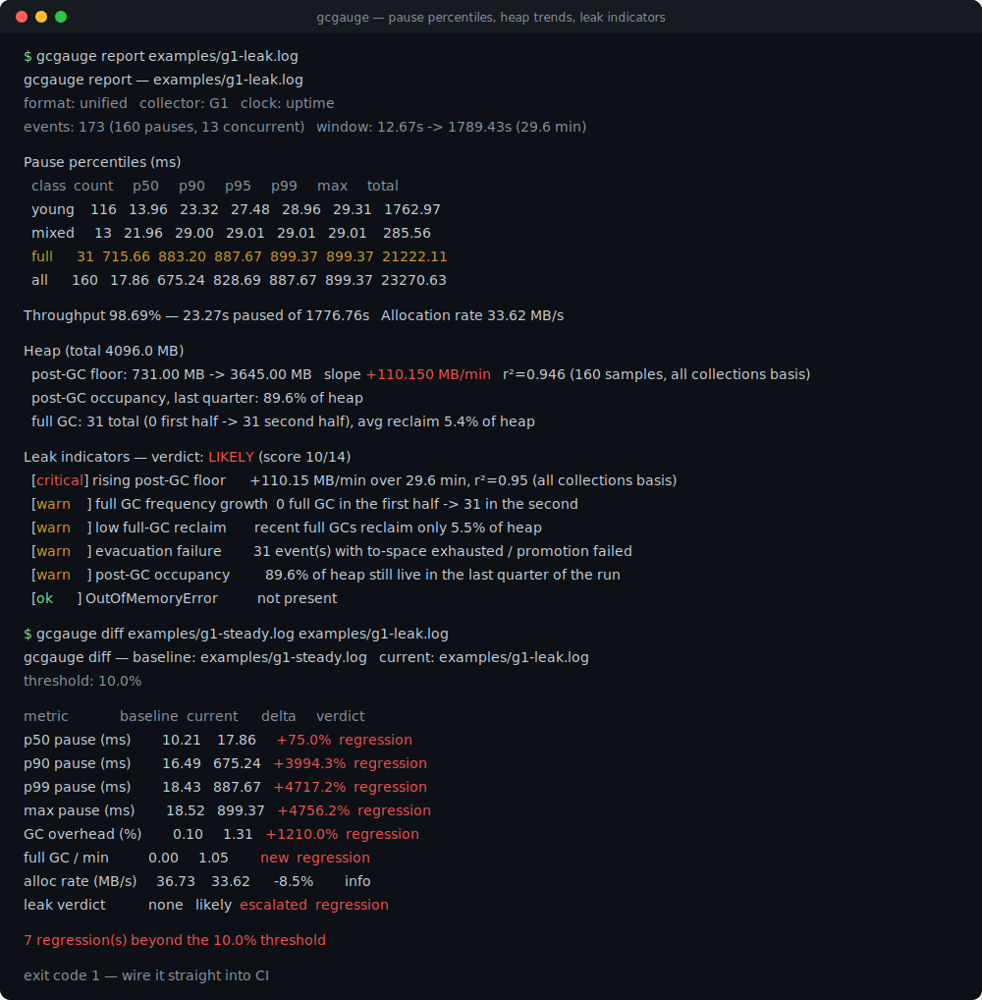
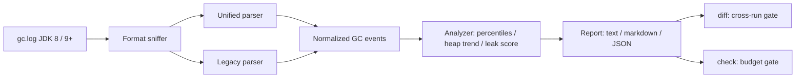

# gcgauge

[English](README.md) | [中文](README.zh.md) | [日本語](README.ja.md)

[](LICENSE) [](CHANGELOG.md) [](pyproject.toml)  [](CONTRIBUTING.md)

**Open-source JVM GC log analyzer — pause percentiles, heap trends, and leak indicators as deterministic offline reports, with cross-run diffs. No upload, no browser, no vendor.**



```bash
git clone https://github.com/JaydenCJ/gcgauge && cd gcgauge && pip install -e .
```

> **Pre-release:** gcgauge is not yet published to PyPI. Until the first release, clone [JaydenCJ/gcgauge](https://github.com/JaydenCJ/gcgauge) and run `pip install -e .` from the repository root.

## Why gcgauge?

Analyzing a GC log today usually means pasting production logs into a web service and hoping nothing sensitive is in them, or launching a desktop GUI and eyeballing a chart. Neither fits how JVM performance work actually happens: on a server over SSH, in a CI job, comparing this run against last week's. gcgauge is a zero-dependency Python CLI that turns a raw GC log into pause percentiles, heap trends, and a scored leak verdict — and because its reports are byte-identical for identical input, two runs can be diffed mechanically and a regression can fail the build. Logs never leave the machine.

|  | gcgauge | GCeasy | GCViewer | garbagecat |
|---|---|---|---|---|
| Fully offline | Yes | No (upload to a web service) | Yes | Yes |
| Interface | CLI + JSON | Browser | Desktop GUI | CLI |
| Needs a JVM installed | No — any Python 3.9+ | No | Yes | Yes |
| Deterministic, diff-able output | Yes (byte-identical JSON) | No | No | No |
| Cross-run regression gate with exit codes | Yes (`diff`, `check`) | No | No | No |
| Runtime dependencies | 0 | SaaS | Java + GUI toolkit | Java 11+ |

<sub>Characterizations as of 2026-07: GCeasy is an upload-based web analyzer (free tier with API quotas); GCViewer 1.36 is a Swing desktop application; garbagecat 4.x is a Java CLI producing a fixed text report. gcgauge's dependency count is `dependencies = []` in [pyproject.toml](pyproject.toml).</sub>

## Features

- **Pause percentiles that actually happened** — nearest-rank p50/p90/p95/p99/max per collection class (young / mixed / full / ...), never interpolated values no request ever experienced.
- **Two log dialects, one event model** — JDK 9+ unified logging (`-Xlog:gc`) and JDK 8 `-XX:+PrintGCDetails`, covering G1, Parallel, Serial, CMS, ZGC, and Shenandoah line shapes, normalized so analysis code never sees the dialect.
- **Leak indicators with receipts** — six weighted heuristics (rising post-GC floor with r², full-GC frequency growth, low full-GC reclaim, evacuation failures, sustained occupancy, OutOfMemoryError) roll into a `none`/`possible`/`likely` verdict; evidence is printed whether triggered or not.
- **Deterministic by construction** — no clocks, no randomness, fixed rounding, sorted JSON keys: identical logs give byte-identical reports on any machine, so reports are commit-able and diff-able artifacts.
- **Cross-run diffs that gate CI** — `gcgauge diff baseline current` compares percentiles, GC overhead, full-GC rate, and the leak verdict with a threshold and exits 1 on regression; both sides accept a raw log or a saved JSON report.
- **Crash-proof parsing** — torn last lines, mixed encodings, out-of-order concatenations, and timestamp-free logs degrade gracefully with explicit warnings instead of tracebacks.

## Quickstart

Install and run against the committed example logs:

```bash
git clone https://github.com/JaydenCJ/gcgauge && cd gcgauge && pip install -e .
gcgauge report examples/g1-leak.log
```

Output (copied from a real run):

```text
gcgauge report — examples/g1-leak.log
format: unified   collector: G1   clock: uptime
events: 173 (160 pauses, 13 concurrent)   window: 12.67s -> 1789.43s (29.6 min)

Pause percentiles (ms)
  class  count     p50     p90     p95     p99     max     total
  young    116   13.96   23.32   27.48   28.96   29.31   1762.97
  mixed     13   21.96   29.00   29.01   29.01   29.01    285.56
  full      31  715.66  883.20  887.67  899.37  899.37  21222.11
  all      160   17.86  675.24  828.69  887.67  899.37  23270.63

Throughput 98.69% — 23.27s paused of 1776.76s   Allocation rate 33.62 MB/s

Heap (total 4096.0 MB)
  post-GC floor: 731.00 MB -> 3645.00 MB   slope +110.150 MB/min   r²=0.946 (160 samples, all collections basis)
  post-GC occupancy, last quarter: 89.6% of heap
  full GC: 31 total (0 first half -> 31 second half), avg reclaim 5.4% of heap

Leak indicators — verdict: LIKELY (score 10/14)
  [critical] rising post-GC floor      +110.15 MB/min over 29.6 min, r²=0.95 (all collections basis)
  [warn    ] full GC frequency growth  0 full GC in the first half -> 31 in the second
  [warn    ] low full-GC reclaim       recent full GCs reclaim only 5.5% of heap
  [warn    ] evacuation failure        31 event(s) with to-space exhausted / promotion failed
  [warn    ] post-GC occupancy         89.6% of heap still live in the last quarter of the run
  [ok      ] OutOfMemoryError          not present
```

Compare two runs — a healthy baseline against the leaking run (exit code 1, so it slots into CI):

```bash
gcgauge diff examples/g1-steady.log examples/g1-leak.log
```

```text
gcgauge diff — baseline: examples/g1-steady.log   current: examples/g1-leak.log
threshold: 10.0%

metric             baseline  current      delta     verdict
p50 pause (ms)        10.21    17.86     +75.0%  regression
p90 pause (ms)        16.49   675.24   +3994.3%  regression
p99 pause (ms)        18.43   887.67   +4717.2%  regression
max pause (ms)        18.52   899.37   +4756.2%  regression
GC overhead (%)        0.10     1.31   +1210.0%  regression
full GC / min          0.00     1.05        new  regression
alloc rate (MB/s)     36.73    33.62      -8.5%        info
leak verdict           none   likely  escalated  regression

7 regression(s) beyond the 10.0% threshold
```

Or gate a single run against explicit budgets, and keep a JSON baseline instead of a multi-megabyte log:

```bash
gcgauge check examples/g1-steady.log --max-p99 50 --min-throughput 99 --fail-on-leak possible
gcgauge report examples/g1-steady.log --format json -o baseline.json   # diff against it next week
```

## Supported log formats

| Format | JVM flags | Collectors covered |
|---|---|---|
| Unified logging (JDK 9+) | `-Xlog:gc` (any of the `uptime`/`time`/no decorations) | G1, Parallel, Serial, ZGC (incl. generational), Shenandoah |
| Legacy (JDK 8) | `-XX:+PrintGCDetails` with `-XX:+PrintGCTimeStamps` and/or `-XX:+PrintGCDateStamps` | Parallel, Serial, CMS, G1 |

The format is sniffed from content, never from the file name. Verbose detail lines (`gc,phases`, `gc,heap`, region breakdowns) are recognized and skipped; unknown lines never abort a report.

## Leak indicators

| Indicator | Weight | Trigger |
|---|---|---|
| rising post-GC floor | 4 | floor slope > 0, r² ≥ 0.6, rise ≥ 10% of heap, ≥ 4 samples |
| full GC frequency growth | 2 | ≥ 2 full GCs in the second half and ≥ 2× the first half |
| low full-GC reclaim | 2 | recent full GCs reclaim < 10% of heap on average |
| evacuation failure | 1 | any to-space exhausted / promotion failed event |
| post-GC occupancy | 1 | ≥ 85% of heap still live across the last quarter |
| OutOfMemoryError | 4 | mentioned anywhere in the log |

Verdict: score 0 → `none`, 1–3 → `possible`, ≥ 4 → `likely`. The full JSON structure of reports and diffs is documented in [`docs/json-output.md`](docs/json-output.md), and the sample logs (plus their deterministic generator) live in [`examples/`](examples/).

## Verification

This repository ships no CI; every claim above is verified by local runs. Reproduce them from a checkout of this repository:

```bash
pip install -e '.[dev]' && pytest && bash scripts/smoke.sh
```

Output (copied from a real run, truncated with `...`):

```text
90 passed in 1.70s
...
[check] 3 of 3 check(s) failed
SMOKE OK
```

## Architecture



## Roadmap

- [x] Unified + legacy parsers, pause percentiles, heap trends, six leak indicators, text/markdown/JSON reports, cross-run diff gate, CI budget gate (v0.1.0)
- [ ] PyPI release with `pip install gcgauge`
- [ ] ZGC/Shenandoah phase-level pauses from `gc,phases` decorated logs
- [ ] Per-cause pause breakdown and worst-pause drill-down with log line references
- [ ] Self-contained single-file HTML report (still fully offline)

See the [open issues](https://github.com/JaydenCJ/gcgauge/issues) for the full list.

## Contributing

Contributions are welcome — start with a [good first issue](https://github.com/JaydenCJ/gcgauge/issues?q=is%3Aissue+is%3Aopen+label%3A%22good+first+issue%22) or open a [discussion](https://github.com/JaydenCJ/gcgauge/discussions). See [CONTRIBUTING.md](CONTRIBUTING.md) for the development setup.

## License

[MIT](LICENSE)
