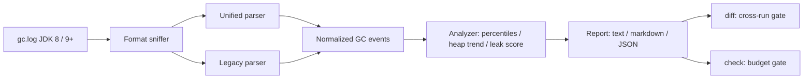

# gcgauge

[English](README.md) | [中文](README.zh.md) | [日本語](README.ja.md)

[](LICENSE) [](CHANGELOG.md) [](pyproject.toml)  [](CONTRIBUTING.md)

**开源 JVM GC 日志分析器 —— 将停顿百分位、堆趋势与内存泄漏指标输出为确定性的离线报告，并支持跨运行 diff。不上传、不用浏览器、不绑定厂商。**


```bash
git clone https://github.com/JaydenCJ/gcgauge && cd gcgauge && pip install -e .
```

> **预发布：** gcgauge 尚未发布到 PyPI。在首个正式版之前，请克隆 [JaydenCJ/gcgauge](https://github.com/JaydenCJ/gcgauge) 并在仓库根目录执行 `pip install -e .`。

## 为什么选 gcgauge？

如今分析一份 GC 日志，通常意味着把生产日志粘贴进某个网页服务并祈祷里面没有敏感信息，或者打开一个桌面 GUI 靠肉眼看图。这两种方式都不符合 JVM 性能工作的实际场景：SSH 登录服务器、跑在 CI 任务里、把这次运行和上周的对比。gcgauge 是一个零依赖的 Python CLI，把原始 GC 日志变成停顿百分位、堆趋势和带评分的泄漏结论——而且报告对相同输入逐字节一致，因此两次运行可以机械地 diff，回归可以直接让构建失败。日志永远不离开本机。

|  | gcgauge | GCeasy | GCViewer | garbagecat |
|---|---|---|---|---|
| 完全离线 | 是 | 否（需上传到网页服务） | 是 | 是 |
| 交互形式 | CLI + JSON | 浏览器 | 桌面 GUI | CLI |
| 是否需要安装 JVM | 否 —— 任意 Python 3.9+ | 否 | 是 | 是 |
| 确定性、可 diff 的输出 | 是（逐字节一致的 JSON） | 否 | 否 | 否 |
| 带退出码的跨运行回归门禁 | 是（`diff`、`check`） | 否 | 否 | 否 |
| 运行时依赖 | 0 | SaaS | Java + GUI 工具包 | Java 11+ |

<sub>以上特征基于 2026-07 的情况：GCeasy 是基于上传的网页分析器（免费档有 API 配额）；GCViewer 1.36 是 Swing 桌面应用；garbagecat 4.x 是输出固定文本报告的 Java CLI。gcgauge 的依赖数即 [pyproject.toml](pyproject.toml) 中的 `dependencies = []`。</sub>

## 特性

- **真实发生过的停顿百分位** —— 按回收类别（young / mixed / full / ...）给出最近秩 p50/p90/p95/p99/max，绝不输出任何请求从未经历过的插值。
- **两种日志方言，一个事件模型** —— JDK 9+ 统一日志（`-Xlog:gc`）与 JDK 8 `-XX:+PrintGCDetails`，覆盖 G1、Parallel、Serial、CMS、ZGC、Shenandoah 的行格式，归一化后分析代码完全感知不到方言差异。
- **有凭有据的泄漏指标** —— 六个加权启发式（带 r² 的 GC 后堆底线上升、full GC 频率增长、full GC 回收率过低、疏散失败、持续高占用、OutOfMemoryError）汇总为 `none`/`possible`/`likely` 结论；无论是否触发都打印证据。
- **构造上的确定性** —— 不读时钟、无随机数、固定舍入、JSON 键排序：相同日志在任何机器上产出逐字节一致的报告，报告因此成为可提交、可 diff 的工件。
- **能卡住 CI 的跨运行 diff** —— `gcgauge diff baseline current` 按阈值比较百分位、GC 开销、full GC 频率与泄漏结论，出现回归即以退出码 1 结束；两侧既可以是原始日志也可以是保存的 JSON 报告。
- **摔不坏的解析器** —— 截断的末行、混合编码、乱序拼接、无时间戳的日志都会优雅降级并给出明确警告，而不是抛出堆栈。

## 快速上手

安装并对仓库自带的示例日志运行：

```bash
git clone https://github.com/JaydenCJ/gcgauge && cd gcgauge && pip install -e .
gcgauge report examples/g1-leak.log
```

输出（摘自真实运行）：

```text
gcgauge report — examples/g1-leak.log
format: unified   collector: G1   clock: uptime
events: 173 (160 pauses, 13 concurrent)   window: 12.67s -> 1789.43s (29.6 min)

Pause percentiles (ms)
  class  count     p50     p90     p95     p99     max     total
  young    116   13.96   23.32   27.48   28.96   29.31   1762.97
  mixed     13   21.96   29.00   29.01   29.01   29.01    285.56
  full      31  715.66  883.20  887.67  899.37  899.37  21222.11
  all      160   17.86  675.24  828.69  887.67  899.37  23270.63

Throughput 98.69% — 23.27s paused of 1776.76s   Allocation rate 33.62 MB/s

Heap (total 4096.0 MB)
  post-GC floor: 731.00 MB -> 3645.00 MB   slope +110.150 MB/min   r²=0.946 (160 samples, all collections basis)
  post-GC occupancy, last quarter: 89.6% of heap
  full GC: 31 total (0 first half -> 31 second half), avg reclaim 5.4% of heap

Leak indicators — verdict: LIKELY (score 10/14)
  [critical] rising post-GC floor      +110.15 MB/min over 29.6 min, r²=0.95 (all collections basis)
  [warn    ] full GC frequency growth  0 full GC in the first half -> 31 in the second
  [warn    ] low full-GC reclaim       recent full GCs reclaim only 5.5% of heap
  [warn    ] evacuation failure        31 event(s) with to-space exhausted / promotion failed
  [warn    ] post-GC occupancy         89.6% of heap still live in the last quarter of the run
  [ok      ] OutOfMemoryError          not present
```

对比两次运行 —— 用健康基线对比泄漏的那次（退出码 1，可直接接入 CI）：

```bash
gcgauge diff examples/g1-steady.log examples/g1-leak.log
```

```text
gcgauge diff — baseline: examples/g1-steady.log   current: examples/g1-leak.log
threshold: 10.0%

metric             baseline  current      delta     verdict
p50 pause (ms)        10.21    17.86     +75.0%  regression
p90 pause (ms)        16.49   675.24   +3994.3%  regression
p99 pause (ms)        18.43   887.67   +4717.2%  regression
max pause (ms)        18.52   899.37   +4756.2%  regression
GC overhead (%)        0.10     1.31   +1210.0%  regression
full GC / min          0.00     1.05        new  regression
alloc rate (MB/s)     36.73    33.62      -8.5%        info
leak verdict           none   likely  escalated  regression

7 regression(s) beyond the 10.0% threshold
```

也可以用明确的预算卡住单次运行，并保留一个 JSON 基线来替代动辄数 MB 的日志：

```bash
gcgauge check examples/g1-steady.log --max-p99 50 --min-throughput 99 --fail-on-leak possible
gcgauge report examples/g1-steady.log --format json -o baseline.json   # 下周直接和它 diff
```

## 支持的日志格式

| 格式 | JVM 参数 | 覆盖的收集器 |
|---|---|---|
| 统一日志（JDK 9+） | `-Xlog:gc`（`uptime`/`time`/无装饰均可） | G1、Parallel、Serial、ZGC（含分代）、Shenandoah |
| 传统格式（JDK 8） | `-XX:+PrintGCDetails` 搭配 `-XX:+PrintGCTimeStamps` 和/或 `-XX:+PrintGCDateStamps` | Parallel、Serial、CMS、G1 |

格式按内容嗅探判断，从不依赖文件名。冗余的细节行（`gc,phases`、`gc,heap`、region 明细）会被识别并跳过；未知行绝不会让报告中断。

## 泄漏指标

| 指标 | 权重 | 触发条件 |
|---|---|---|
| GC 后堆底线上升 | 4 | 底线斜率 > 0、r² ≥ 0.6、上升 ≥ 堆的 10%、样本 ≥ 4 |
| full GC 频率增长 | 2 | 后半程 full GC ≥ 2 次且 ≥ 前半程的 2 倍 |
| full GC 回收率过低 | 2 | 近期 full GC 平均回收 < 堆的 10% |
| 疏散失败 | 1 | 出现任意 to-space exhausted / promotion failed 事件 |
| GC 后占用率 | 1 | 最后四分之一区间 ≥ 85% 的堆仍然存活 |
| OutOfMemoryError | 4 | 日志中任何位置出现 |

结论：得分 0 → `none`，1–3 → `possible`，≥ 4 → `likely`。报告与 diff 的完整 JSON 结构见 [`docs/json-output.md`](docs/json-output.md)，示例日志（及其确定性生成器）位于 [`examples/`](examples/)。

## 验证

本仓库不附带任何 CI；上述所有结论均由本地运行验证。在本仓库的检出目录中即可复现：

```bash
pip install -e '.[dev]' && pytest && bash scripts/smoke.sh
```

输出（摘自真实运行，以 `...` 截断）：

```text
90 passed in 1.70s
...
[check] 3 of 3 check(s) failed
SMOKE OK
```

## 架构



## 路线图

- [x] 统一 + 传统双解析器、停顿百分位、堆趋势、六项泄漏指标、text/markdown/JSON 报告、跨运行 diff 门禁、CI 预算门禁（v0.1.0）
- [ ] 发布到 PyPI，支持 `pip install gcgauge`
- [ ] 从带 `gc,phases` 装饰的日志解析 ZGC/Shenandoah 阶段级停顿
- [ ] 按原因细分停顿，并支持带日志行号引用的最差停顿下钻
- [ ] 自包含的单文件 HTML 报告（依然完全离线）

完整列表见 [open issues](https://github.com/JaydenCJ/gcgauge/issues)。

## 参与贡献

欢迎贡献 —— 可以从 [good first issue](https://github.com/JaydenCJ/gcgauge/issues?q=is%3Aissue+is%3Aopen+label%3A%22good+first+issue%22) 入手，或发起 [discussion](https://github.com/JaydenCJ/gcgauge/discussions)。开发环境搭建见 [CONTRIBUTING.md](CONTRIBUTING.md)。

## 许可证

[MIT](LICENSE)
